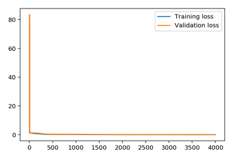
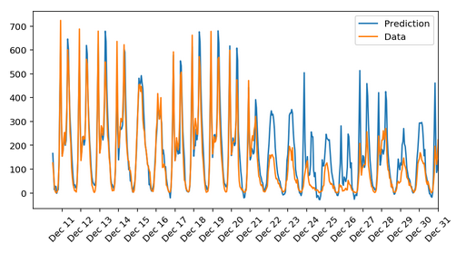

# Predicting Bike-Sharing Patterns

## Table of contents
* [Overview](#overview)
* [Results](#results)
* [Technologies](#Technologies)

## Overview

This project is a part of Udacity Deep Learning Nanodegree. The goal of this project is to build, train and test the neural network in numpy to forecast daily bike rental ridership. The forward pass and back propagations were implemented from scratch.

For this project I used the two-year historical log corresponding to years 2011 and 2012 from Capital Bikeshare system, Washington D.C., USA. The data used for this project is shared by the courtesy of [the UCI Machine Learning Database](https://archive.ics.uci.edu/ml/datasets/Bike+Sharing+Dataset). The full description of the data used can be found [here](https://github.com/lkolada/predicting-bike-sharing-patterns/blob/master/Bike-Sharing-Dataset/Readme.txt).

## Results
**Training and validation loss**:  

**Predicted and test data**:  

Findings:
* Training loss: 0.061
* Validation loss: 0.146
* Overall, it seems that the network learned the patterns very well
* However, the model did not recognise seasonality patterns, such as Christmas/New Year season

## Technologies

* Python 3.6
* Libraries: numpy, pandas, matplotlib

